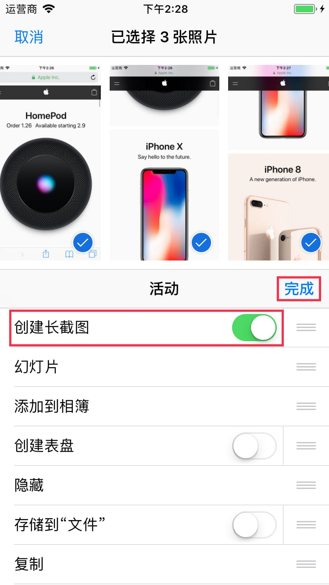
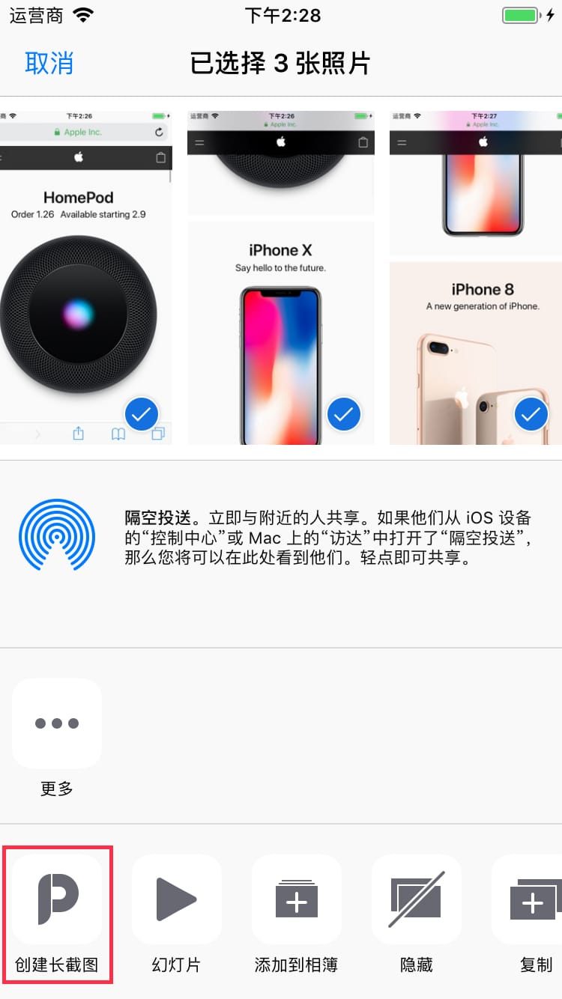
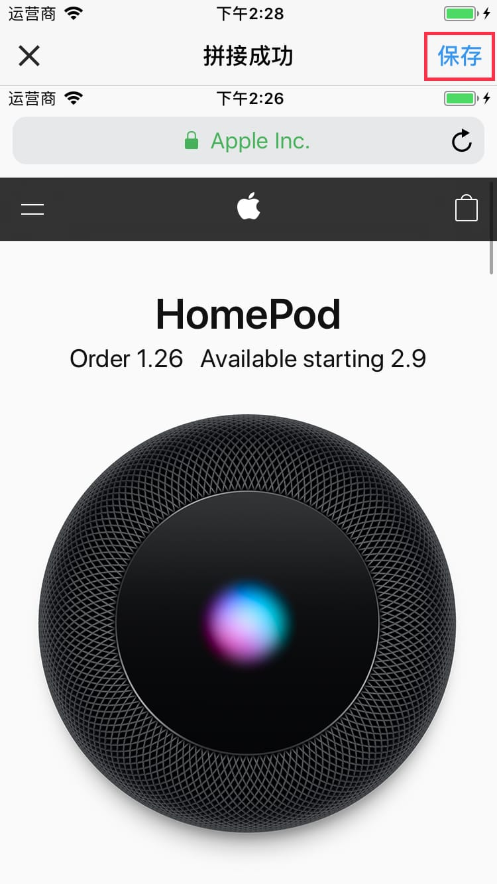

# Create Scrollshot Extension Documentation

**Create Scrollshot** extension requires you to enable it manually.

---

`1` In the system sharing panel, tap the rightmost **More** button in the action extension bar.

---

`2` Find **Create Scrollshot** in the list, and turn on the switch on the right side, then tap **Done**.

---

`3` Tap **Create Scrollshot** to launch the extension.

---

`4` If stitch succeed, tap **Save** to save scrollshot.

