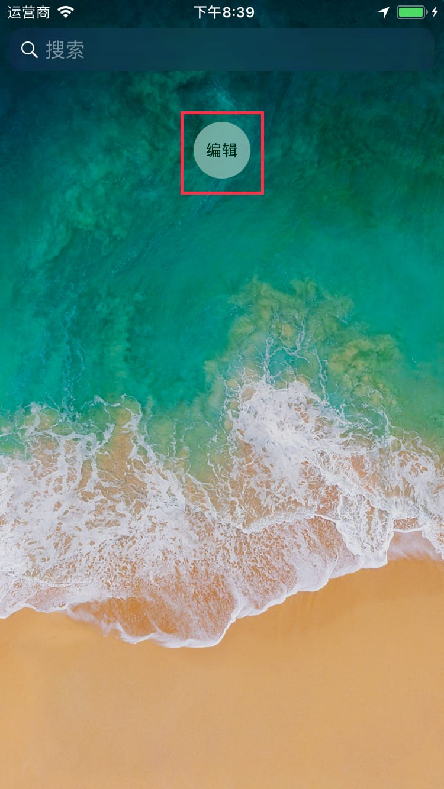
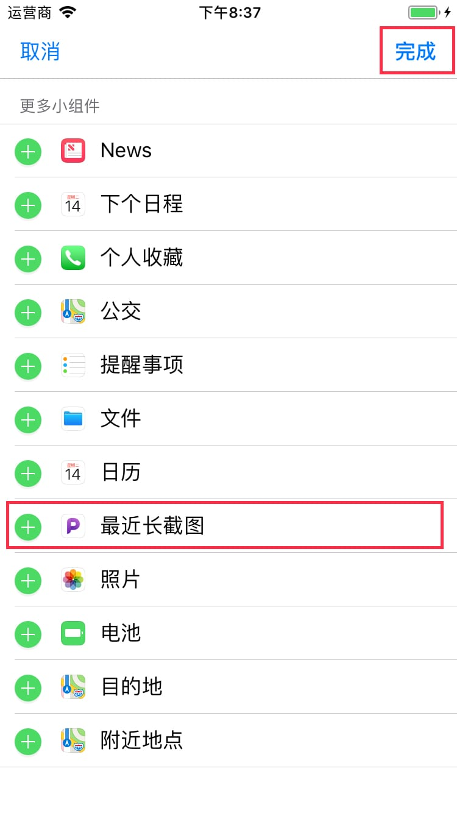
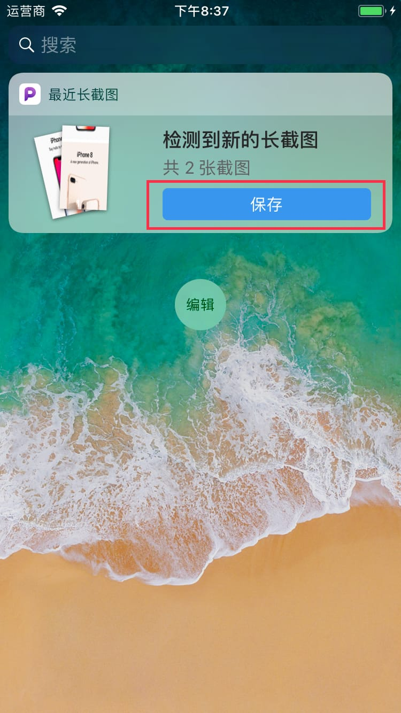

# Recent Scrollshot Widget Document

**Recent Scrollshot** widget requires you to enable it manually.

---

`1` Find **Edit** button in the bottom of **Today** page in **Notification Center**.

---

`2` Find **Recent Scrollshot** in the list, tap the **+** button on the left side, then tap **Done**.

---

`3` After you manually take screenshots in sequence, the widget will recognize and automatically stitch them together. If stitch succeed, you can save the long screenshot in widget directly.

