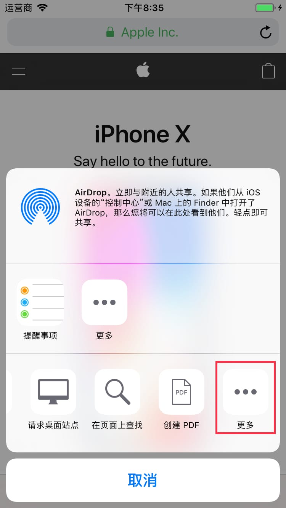
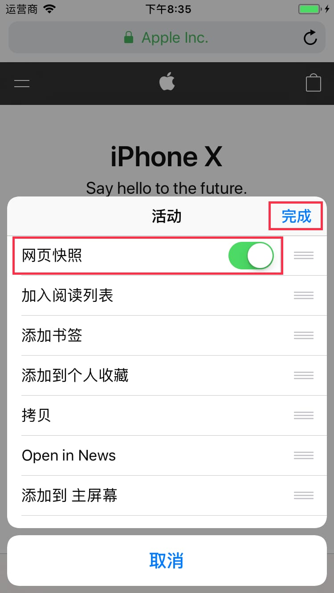
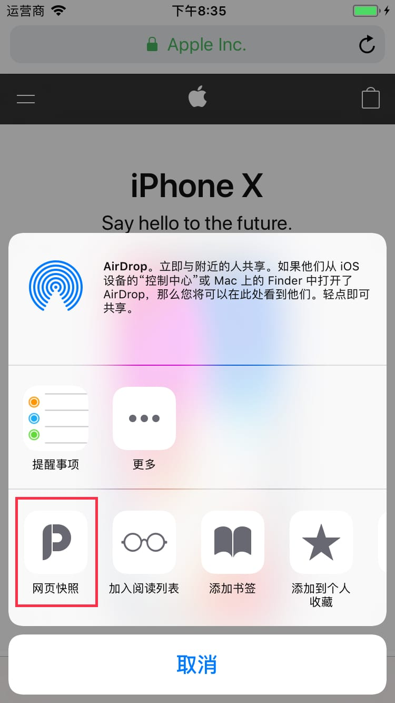
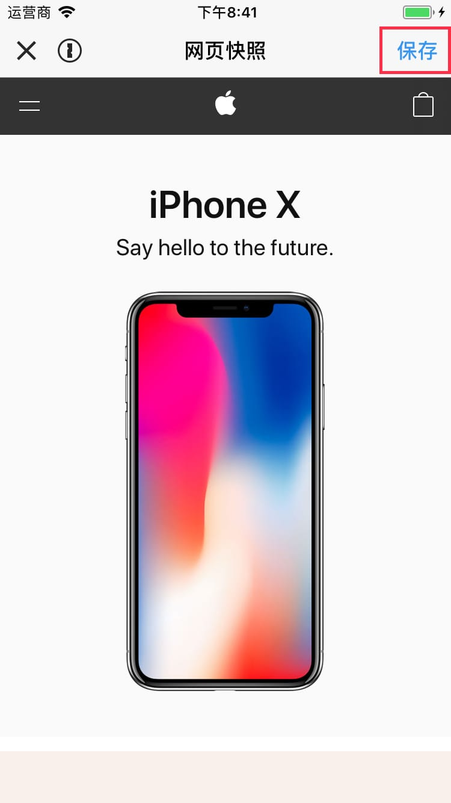

**網頁快照** 插件需要您手動打開。

---

`1` 在分享面板的動作插件欄最右側點擊 **更多** 按鈕。

---

`2` 在列表裏找到 **網頁快照** 並且打開右側開關，然後點擊 **完成**。

---

`3` 點擊 **網頁快照** 按鈕啟動插件。

---

`4` 點擊 **保存** 按鈕就可以保存網頁截圖了。

---

`5` 如果您啟動插件時遇到無法加載網頁的情況，那可能是您的手機仍未授權 Picsew 訪問網絡。請到系統的 **設置** 應用裏檢查您是否已經授權。
